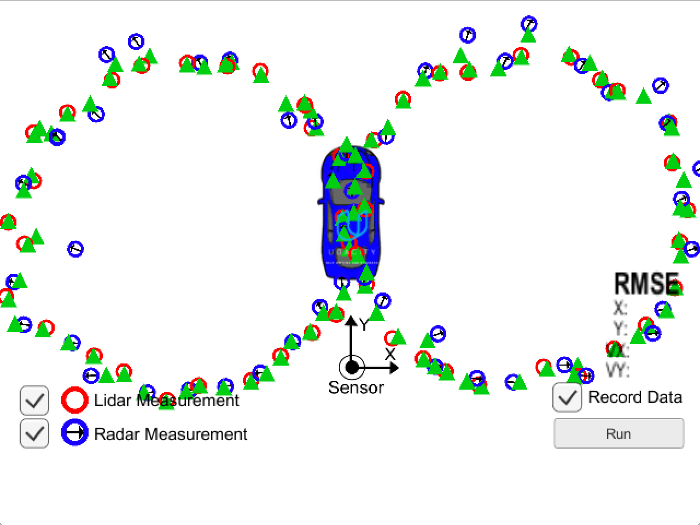

# Extended Kalman Filter Project

By: Chris Gundling, chrisgundling@gmail.com

Self-Driving Car Engineer Nanodegree Program

---

## Dependencies

* cmake >= 3.5
 * All OSes: [click here for installation instructions](https://cmake.org/install/)
* make >= 4.1
  * Linux: make is installed by default on most Linux distros
  * Mac: [install Xcode command line tools to get make](https://developer.apple.com/xcode/features/)
  * Windows: [Click here for installation instructions](http://gnuwin32.sourceforge.net/packages/make.htm)
* gcc/g++ >= 5.4
  * Linux: gcc / g++ is installed by default on most Linux distros
  * Mac: same deal as make - [install Xcode command line tools]((https://developer.apple.com/xcode/features/)
  * Windows: recommend using [MinGW](http://www.mingw.org/)

## Basic Build Instructions

1. Clone this repo.
2. In the build directory compile: `cmake .. && make` 
3. Run it: `./ExtendedKF path/to/input.txt path/to/output.txt`. You can find
   some sample inputs in 'data/'.
    - eg. `./ExtendedKF ../data/sample-laser-radar-measurement-data-1.txt output.txt`

## Results
Two Laser and Radar location files were provided for this project. The RSME and traking path over the measurements is shown for both cases in the figures below.

## Simulation
A simulator was also provided and the final results from the simulator are shown in the figure below. Both Lidar (Kalman Filter) and Radar (Extended Kalman Filter) were used to track the vehicle through its path. 

